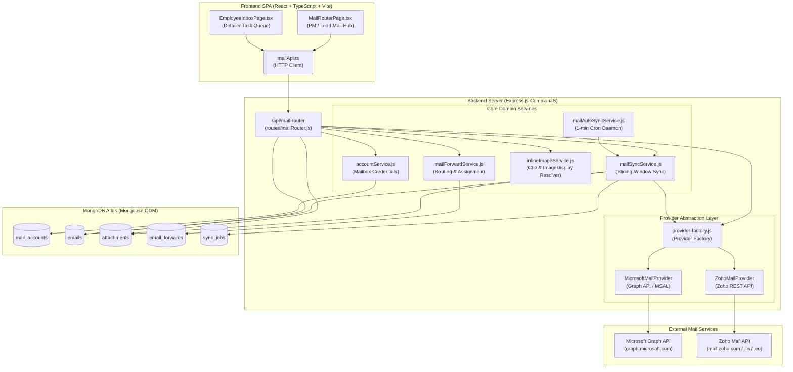
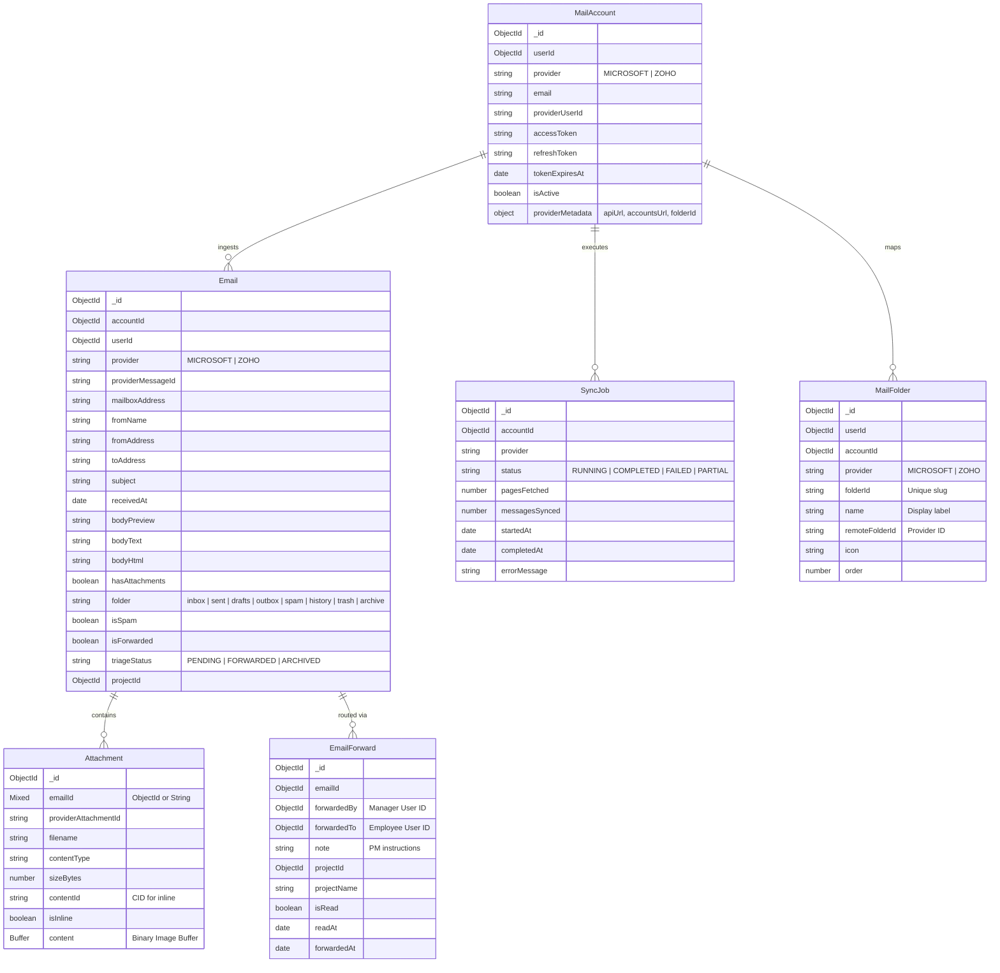
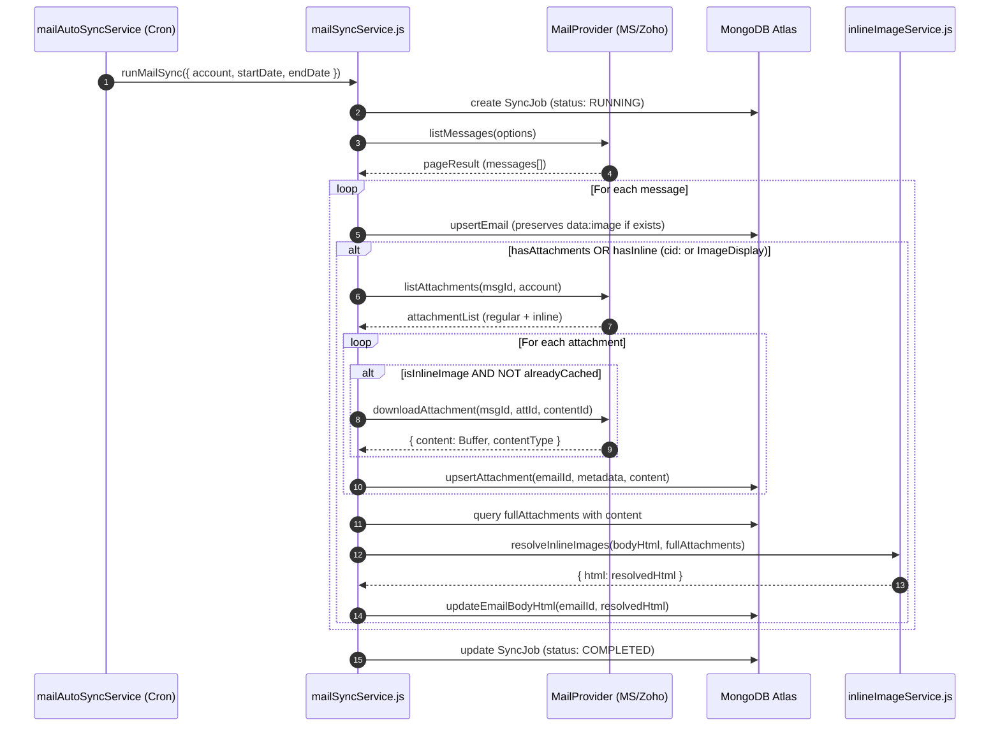
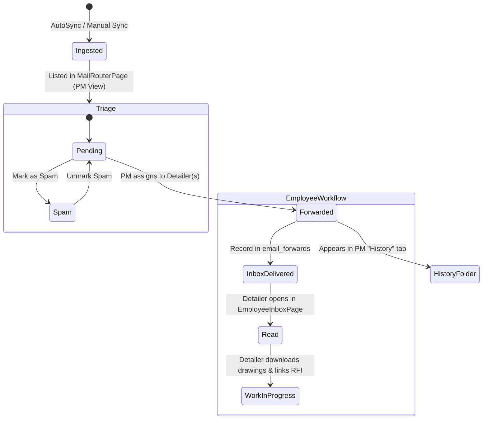

# Mail Router & Email Delegation Architecture

## 1. Executive Overview

The **Mail Router** module is a mission-critical subsystem of the Steel Detailing Drawing Management System (DMS). In structural steel detailing workflows, clients, general contractors, structural engineers, and fabricators communicate revisions, Requests for Information (RFIs), design addenda, and approval drawings primarily via email. 

The Mail Router bridges external communication channels directly into internal detailing operations:
- **Unified Multi-Provider Mailbox Hub**: Seamlessly connects corporate Microsoft 365 (Graph API) and Zoho Mail accounts into a centralized interface.
- **Automated Ingestion & Sync**: Employs an intelligent sliding-window polling engine with background cron scheduling and concurrency deduplication.
- **Inline Image & Media Re-hydration Engine**: Automatically resolves nested MIME `cid:` references and provider-specific media paths (e.g. Zoho `/mail/ImageDisplay?...`) into base64 data URIs for crystal-clear client rendering.
- **CAD/Drawing Attachment Optimization**: Defers heavy binary downloads (drawings, PDFs, DWG/DXF files) to on-demand requests while eagerly caching lightweight inline images required for email rendering.
- **Role-Based Email Triage & Delegation**: Enables Project Managers and Squad Leads to route incoming emails with custom engineering instructions to specific detailers and associate them directly with fabrication projects.
- **Dedicated Employee Inbox**: Provides individual detailers with a clean, focused task queue displaying PM notes, read/unread status tracking, and drawing downloads.

---

## 2. High-Level Architecture Topology



---

## 3. Core Architectural Principles

1. **Provider Agnostic Abstraction**: The core routing, ingestion, and UI layers interact exclusively through the uniform `MailProvider` interface (`listMessages`, `getMessage`, `listAttachments`, `downloadAttachment`). Provider-specific nuances (OAuth endpoints, Graph vs REST queries, header formats) are fully encapsulated within `services/mail/providers/`.
2. **Two-Tier Hydration Strategy**:
   - *Tier 1 (Sync Time)*: Message headers, subject, sender, preview snippets, date, and attachment metadata are eagerly saved. Only inline images needed for the email preview are downloaded.
   - *Tier 2 (On-Demand / View Time)*: When a PM opens an email, any missing inline images are lazily re-hydrated and resolved into `bodyHtml`. Heavy standalone files (PDF blueprints, DWG/DXF files) remain deferred until the user clicks "Download".
3. **Self-Healing Persistence**: Once an email's inline images are resolved into base64 data URIs, the updated HTML is persisted back to MongoDB. Future sync cycles check for existing `data:image/` content before applying updates, preventing unauthenticated remote URLs from regressing resolved content.
4. **Resilient Token Management**: Access tokens are refreshed proactively before expiration (60-second safety window). If expired during request execution, the client catches the 401 error, triggers a refresh with the stored `refreshToken`, updates MongoDB, and retries seamlessly.

---

## 4. Domain Data Model (Mongoose Schemas)



### Key Schema Design Decisions:
- **`Attachment.emailId` (Mixed Type)**: Supports polymorphic querying across both `ObjectId` and legacy `String` references via `$in: [id, String(id), ObjectId(id)]`.
- **Compound Unique Index on `Attachment`**: `{ emailId: 1, providerAttachmentId: 1 }` prevents duplicate attachments when multiple sync passes occur.
- **Fast Email Projections**: List views (`listEmailsInWindow`) use `.select('-content -bodyHtml')` to prevent megabytes of HTML/base64 strings from choking network bandwidth.

---

## 5. Provider Integration Layer

### 5.1 Microsoft 365 (Graph API Provider)
- **Authentication**: MSAL Node (`@azure/msal-node`) with OAuth 2.0 Authorization Code flow and confidential client credentials.
- **Base Endpoint**: `https://graph.microsoft.com/v1.0`
- **Scopes**: `Mail.Read`, `Mail.ReadWrite`, `Mail.Send`, `offline_access`.
- **Folder Mapping**:
  - `inbox` -> `/me/mailFolders/Inbox/messages`
  - `sent` -> `/me/mailFolders/SentItems/messages`
  - `spam` -> `/me/mailFolders/JunkEmail/messages`
- **Inline Image Handling**: Graph returns inline images with `isInline: true` and an explicit `contentId` (referenced in body as `src="cid:..."`).

### 5.2 Zoho Mail API Provider
- **Authentication**: OAuth 2.0 Code Flow with multi-datacenter dynamic hostname discovery.
- **Datacenter Discovery**: `extractZohoDatacenter(apiDomain, accountsUrl)` detects the correct regional endpoints:
  - US/Global: `https://accounts.zoho.com` & `https://mail.zoho.com/api`
  - India: `https://accounts.zoho.in` & `https://mail.zoho.in/api`
  - Europe: `https://accounts.zoho.eu` & `https://mail.zoho.eu/api`
- **Header Injection**: Requests carry `Authorization: Zoho-oauthtoken <access_token>`.
- **Folder Discovery**: Zoho uses dynamic integer BigInt folder IDs discovered via `/accounts/{accountId}/folders`:
  - Default Inbox: Folder `0` or explicit folder ID.
  - Sent, Drafts, Outbox, and Spam folders resolved via account ID offsets (`baseId + 8n` for Drafts, `baseId + 13n` for Outbox) or dynamic folder name matching.
- **Inline Image Attachment Nuance**:
  - Zoho requires `?includeInline=true` on the attachment info endpoint:
    `GET /accounts/{accId}/folders/{folderId}/messages/{msgId}/attachmentinfo?includeInline=true`
  - Inline items are returned in a dedicated `rawData.inline` array alongside `rawData.attachments`.
  - Binary inline download utilizes either `/attachments/{attachmentId}` or `/inline?contentId={cid}`.

### 5.3 Mailbox Folder Taxonomy & Provider Differentiation

| Folder ID | Folder Name | Microsoft 365 (Outlook) | Zoho Mail | Sync Behavior |
| :--- | :--- | :---: | :---: | :--- |
| `inbox` | Inbox | ✅ | ✅ | Windowed date range sync |
| `sent` | Sent | ✅ | ✅ | Windowed date range sync |
| `drafts` | Drafts | ✅ | ✅ | **No date filter**: syncs all active drafts (`/mailFolders/drafts` for MS; `in:drafts` for Zoho) |
| `outbox` | Outbox | ❌ *(Deprecated in Modern Outlook)* | ✅ | **No date filter**: syncs pending unsent messages (`in:outbox` for Zoho) |
| `spam` | Spam | ✅ | ✅ | **No date filter**: syncs junk/spam folders |
| `history` | History | ✅ | ✅ | Local DB index: emails forwarded or delegated to team members |
| `custom` | Custom Folder | ✅ *(User-created)* | ✅ *(User-created)* | Windowed/dynamic sync targeted by `remoteFolderId` |

> [!NOTE]
> **Dynamic Remote Folder Discovery & Mapping (`+ Add Folder`)**:
> Users can discover and map arbitrary remote mailbox folders (e.g. `SpringField`, `Client Approvals`) directly from connected accounts.
> - **Provider-Agnostic Interface**: `mailProvider.listRemoteFolders(account)` exposes a uniform interface for both Microsoft Graph and Zoho Mail APIs.
> - **Folder Mapping Schema**: Stored in `mail_folders` as `App Folder (folderId) → Provider → Remote Folder ID`.
> - **Duplicate Prevention**: Compound unique indexes (`{ userId, provider, remoteFolderId }` and `{ userId, provider, folderId }`) strictly prohibit duplicate remote mappings.
> - **Modern Outlook Exclusion**: Modern Outlook and Microsoft Graph API do not expose an active Outbox folder because client-side outboxes have been deprecated in web/modern Outlook. When a user switches to the Microsoft mailbox tab, the system automatically redirects away from Outbox to Inbox.

---

## 6. Inline Image Processing Engine (`inlineImageService.js`)

Email clients (Outlook vs. Zoho Mail) format embedded images, signatures, and screenshots in fundamentally different ways:

| Feature | Outlook / Standard MIME | Zoho Mail Web Client |
| :--- | :--- | :--- |
| **HTML Source Reference** | `src="cid:image001.png@01D..."` | `src="/mail/ImageDisplay?na=...&nmsgId=...&f=1.jpg&mode=inline&cid=..."` |
| **Browser Execution** | Broken (Browser doesn't know `cid:`) | Broken 404 (Relative URL to local host fails) |
| **Resolution Strategy** | Match by `contentId` or filename in CID | Extract `cid` & `f` parameters from query string |
| **Output Format** | Base64 Data URI (`data:image/png;base64,...`) | Base64 Data URI (`data:image/jpeg;base64,...`) |

### Resolution Algorithm:
1. **Pass 1 - Outlook CID Resolution**:
   - Regex matches `src=["']cid:([^"']+)["']`.
   - Cleans delimiters (`<...>` -> `...`).
   - Matches against `attachmentsWithContent` by `contentId` or filename.
   - Detects MIME type using magic bytes (`FF D8 FF` for JPEG, `89 50 4E 47` for PNG, etc.).
   - Injects `data:${mime};base64,${buffer.toString('base64')}`.
2. **Pass 2 - Zoho ImageDisplay Resolution**:
   - Regex matches `src=(["'])([^"']*ImageDisplay[^"']*)\1`.
   - Parses URL parameters using `/(?:[?&]|&amp;)cid=([^&"'\s>]+)/i` and `/(?:[?&]|&amp;)f=([^&"'\s>]+)/i`.
   - Matches corresponding inline attachment buffer from DB.
   - Replaces the exact relative URL string with the base64 Data URI.
3. **Defensive UI Encapsulation**:
   - Frontend components (`MailRouterPage.tsx`, `EmployeeInboxPage.tsx`) apply CSS rule:
     ```css
     img[src^="cid:"],
     img[src*="ImageDisplay"] {
         display: none !important;
     }
     ```
   - Guarantees that if an image is unresolvable or deleted on the remote server, broken placeholders and machine-generated alt text never render.

---

## 7. Ingestion & Synchronization Pipeline



---

## 8. Role-Based Routing & Delegation Workflow



1. **Manager Triage View (`MailRouterPage.tsx`)**:
   - Folders: **Inbox** (unassigned inbound emails), **Sent** (outbound emails), **Spam** (filtered junk), **History** (forwarded/handled emails).
   - Date range filtering via `rsuite` `DateRangePicker`.
   - Real-time search across sender, subject, and preview snippets.
2. **Delegation / Forwarding Action (`POST /emails/:id/forward`)**:
   - Manager selects one or more Detailers (`recipientIds`).
   - Enters engineering notes (e.g., *"Check connection detail on grid line 4-B vs contract drawings"*).
   - Optionally attaches to an active project (`projectId`, `projectName`).
   - Flags email as `triageStatus: 'FORWARDED'`, `isForwarded: true`.
   - Creates `EmailForward` documents for each assigned employee.
3. **Detailer Delivery View (`EmployeeInboxPage.tsx`)**:
   - Displays real-time navbar unread badge via `GET /employee/unread-count`.
   - Dedicated clean view showing Manager instructions highlighted at the top.
   - 1-click preview and download of drawing attachments.
   - Automatically marks item as read upon viewing (`POST /employee/inbox/:id/read`).

---

## 9. API Interface Specifications

| Method | Endpoint | Role | Description |
| :--- | :--- | :--- | :--- |
| `GET` | `/api/mail-router/auth/microsoft` | Manager | Generate Microsoft OAuth authorization URL |
| `GET` | `/api/mail-router/auth/microsoft/callback` | Public | OAuth code exchange callback for Microsoft |
| `GET` | `/api/mail-router/auth/zoho` | Manager | Generate Zoho OAuth authorization URL |
| `GET` | `/api/mail-router/auth/zoho/callback` | Public | OAuth code exchange callback for Zoho |
| `GET` | `/api/mail-router/accounts` | Manager | List connected mailboxes and active status |
| `DELETE` | `/api/mail-router/accounts/:id` | Manager | Disconnect and remove a mailbox connection |
| `POST` | `/api/mail-router/accounts/:id/active` | Manager | Set default active mailbox for current user |
| `POST` | `/api/mail-router/sync` | Manager | Trigger on-demand sliding-window synchronization |
| `GET` | `/api/mail-router/folders` | Manager | List mailbox folders and counts (supports `?provider=MICROSOFT\|ZOHO`) |
| `GET` | `/api/mail-router/remote-folders` | Manager | Discover remote folders from connected mailbox (Graph / Zoho API) |
| `POST` | `/api/mail-router/custom-folders` | Manager | Map a remote folder into app sidebar (with duplicate prevention) |
| `DELETE` | `/api/mail-router/custom-folders/:id` | Manager | Remove a custom folder mapping from app sidebar |
| `GET` | `/api/mail-router/sync-jobs` | Manager | View sync audit logs, pages fetched, and statuses |
| `GET` | `/api/mail-router/emails` | Manager | Query emails with folder, date window, search & pagination |
| `GET` | `/api/mail-router/emails/:id` | Manager | Get email details, resolve inline images, list attachments |
| `POST` | `/api/mail-router/emails/:id/forward` | Manager | Delegate email to detailers with notes and project link |
| `PATCH` | `/api/mail-router/emails/:id/spam` | Manager | Toggle spam status (syncs folder and `isSpam` flag) |
| `GET` | `/api/mail-router/emails/:id/attachments/:attId/download` | Authenticated | Stream binary drawing or file attachment |
| `GET` | `/api/mail-router/employee/inbox` | Employee | List emails assigned to the requesting detailer |
| `GET` | `/api/mail-router/employee/inbox/:id` | Employee | View assigned email details with PM note |
| `POST` | `/api/mail-router/employee/inbox/:id/read` | Employee | Mark assigned email as read |
| `GET` | `/api/mail-router/employee/unread-count` | Employee | Fetch count of unread assigned emails for badge |
| `GET` | `/api/mail-router/employees` | Manager | List available detailers and employees for delegation |

---

## 10. Operational Diagnostics & Maintenance

### 10.1 Running Background Autosync Verification
To verify the health and status of the automatic background synchronization:
```bash
# Check autosync health status via internal helper:
node -e "
require('dotenv').config();
const { getAutoSyncStatus } = require('./src/modules/mail-router/services/mailAutoSyncService');
getAutoSyncStatus().then(console.log).catch(console.error);
"
```

### 10.2 Resolving Historical Zoho Emails (Backfill)
If older Zoho emails contain unauthenticated `ImageDisplay` links from before inline synchronization was activated, execute the maintenance backfill:
```bash
node backend/scripts/backfill_zoho_inline_images.js
```

### 10.3 Inspecting Token Health
```bash
node -e "
require('dotenv').config();
const mongoose = require('mongoose');
async function check() {
  await mongoose.connect(process.env.MONGO_URI);
  const MailAccount = require('./src/modules/mail-router/mongoose/models/MailAccount');
  const accounts = await MailAccount.find({}).lean();
  for (const a of accounts) {
    console.log(a.provider, a.email, 'Active:', a.isActive, 'Expires:', a.tokenExpiresAt);
  }
  await mongoose.disconnect();
}
check();
"
```
