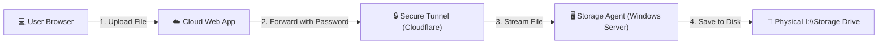
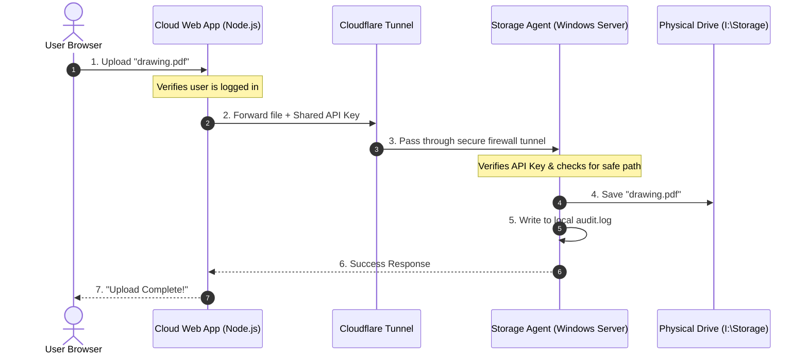

# 🌐 Steel DMS: Server-to-Cloud Storage Connection Guide

This guide explains how we connected our **Web Application** directly to our local **Windows Server Storage Drive (`I:\Storage`)** in a simple, secure way.

---

## 💡 The Connection in Plain English

Before, files uploaded by users were sent to OneDrive. This was slow and complex. Now, files go **directly to your physical Windows Server storage**.

Think of it like a **secure pneumatic tube**:
1. A user uploads a PDF in the Web Browser.
2. The Cloud Server puts the file in the tube, sealing it with a private password (API Key).
3. The tube goes through an encrypted tunnel (Cloudflare) directly into the Windows Server.
4. A security guard (Storage Agent) on the Windows Server verifies the password, checks the file path, and drops it into the physical storage folder.

---

## 🗺️ How it Works (Visual Diagram)

### Simple Request Flow



### Complete Sequence Detail



---

## 🧩 The 3 Core Pieces We Built

Here is what we implemented to make this work:

### 1. The Frontend UI (The Folder Browser)
We created a physical file browser tab in the web app:
* **What you see**: A new **📁 Storage** tab inside each Project view.
* **What it does**: Allows users to drag-and-drop uploads, download files, browse folders, and delete files.
* **Permissions**: Only Admins and Editors see the "Upload" and "Delete" buttons. Viewers can only view/download.

### 2. The Cloud Backend (The Gateway)
The cloud app does not access your hard drive directly. Instead, it acts as a gatekeeper:
* **Authentication**: It checks if the user has a valid web app login token.
* **Proxying**: When you click download, it requests the file from the Windows Server and streams it directly to your browser without storing it in cloud memory.
* **Sync Engine**: When files are uploaded for AI Extraction or RFIs, this sync engine automatically saves a temporary local copy for the AI models, and routes the permanent copy to the correct Windows Server project folder.

### 3. The Windows Storage Agent (The Guard)
A lightweight Node.js program running on your local Windows Server:
* **Direct Access**: It has permission to read and write to `I:\Storage`.
* **Security Guard**: It keeps the server safe using **9 security rules** (rate limits, file extension blocks like `.exe`, path checks to prevent hacking attempts, and an audit log of who did what).

---

## 🛠️ Step-by-Step Setup Guide

Follow these steps to deploy this system:

### Step 1: Run the Storage Agent on the Windows Server
1. Copy the `storage-agent` folder to your Windows Server (e.g., `C:\SteelDMS-Storage-Agent`).
2. Open **Command Prompt** in that folder and run:
   ```cmd
   npm install
   ```
3. Generate a secure random password (API Key) by running:
   ```cmd
   node -e "console.log(require('crypto').randomBytes(32).toString('hex'))"
   ```
   *Copy this password! You will need it in Step 3.*
4. Rename the `.env.example` file to `.env` and fill in your settings:
   ```env
   PORT=4500
   STORAGE_ROOT=I:\Storage
   API_KEY=your_copied_password_here
   READ_ONLY=false
   ```
5. Install the agent as a background Windows Service (so it starts automatically if the server reboots):
   ```cmd
   node install-service.js
   ```

---

### Step 2: Create the Secure Cloudflare Tunnel
This lets the Cloud App talk to your Windows Server without opening any ports on your local router.

1. Sign up for a free account at [dash.cloudflare.com](https://dash.cloudflare.com).
2. Go to **Zero Trust** (left panel) > **Networks** > **Tunnels** > **Create a Tunnel**.
3. Choose **cloudflared**, name it `SteelDMS`, and save.
4. Under **Install connector**, select **Windows** and copy the provided commands. Run them in **PowerShell (as Administrator)** on the Windows Server.
5. In the Cloudflare dashboard, route your tunnel to:
   * **Public Hostname**: `storage.yourcompany.com` (use your actual domain)
   * **Service Type**: `HTTP`
   * **URL**: `localhost:4500`

---

### Step 3: Connect the Cloud Web App
1. Open the `.env` file on your Cloud Web App server.
2. Add these three settings:
   ```env
   STORAGE_ENABLED=true
   STORAGE_AGENT_URL=https://storage.yourcompany.com
   STORAGE_AGENT_API_KEY=your_copied_password_here
   ```
3. Restart your Cloud Web App. In the logs, you should see:
   ```text
   [Storage] Agent connected: https://storage.yourcompany.com
   [Storage] Remote root: I:\Storage
   ```

---

## 🔍 How to Test it is Working

Here are a few quick checks for your team:

* **Health Check**: Open `https://storage.yourcompany.com/health` in your web browser. You should see a success page showing:
  ```json
  {"status":"ok","agent":"steel-dms-storage-agent"}
  ```
* **Browse Check**: Open the web application, go to any project, click the **Storage** tab. You should see the folder contents of your server instantly.
* **Upload Check**: Upload a test PDF. Check the physical `I:\Storage\Projects\[Project_Name]\` folder on the Windows Server to see if the file appeared.
* **Log Check**: Open the `storage-agent/audit.log` file on the Windows Server. You should see a log of your test actions.

---

## 🚨 Troubleshooting Simple Fixes

| Issue | What it means | How to fix |
| :--- | :--- | :--- |
| **"X-API-Key Required" or "Invalid API Key"** | The passwords don't match. | Check that `API_KEY` in the agent `.env` matches `STORAGE_AGENT_API_KEY` in the cloud `.env` exactly. |
| **"Cannot reach Storage Agent"** | The tunnel is down or server is off. | Make sure the Windows Server is running and the Cloudflare Tunnel is showing **Active** in the dashboard. |
| **"Access denied: escapes storage root"** | A folder name had dangerous characters. | The security guard blocked a potential path traversal. Ensure folder names do not contain `/` or `\`. |
